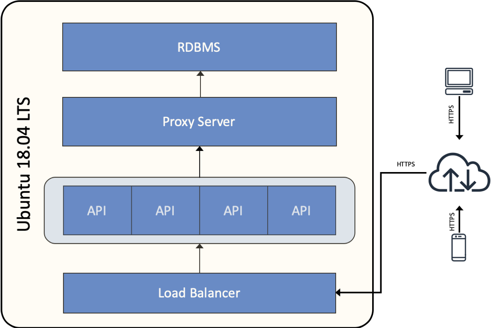

# mysql-demo

Demo of a simple NodeJS API querying a MySQL back-end

## Introduction

This project demonstrates a NodeJS API querying a MySQL database. This project can be deployed on to an on-premises set-up or hosted on a VM on cloud.

## Solution components

The following diagram illustrates the components of this solution. The complete solution is hosted on a Ubuntu 18.04 LTS `t2.meduim` virtual machine provisioned on AWS.

- HTTPS end-point, load balancer, reverse proxy and API caching supprt for NodeJS application instances
- Proxy server for MySQL database
- MySQL database
- API in NodeJS

## Installation

To get started, head to [project documentation](doc/README.md).

## API documentation

The APIs are documented [here](doc/api.yaml).
